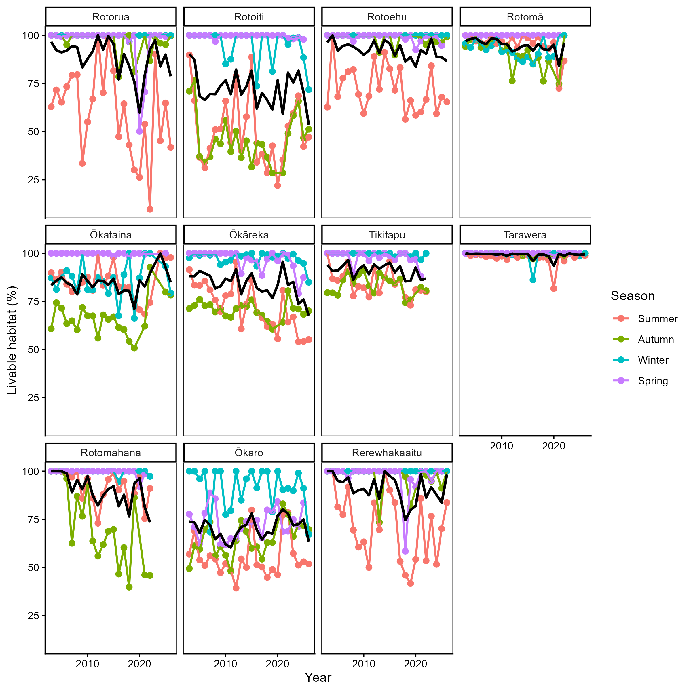
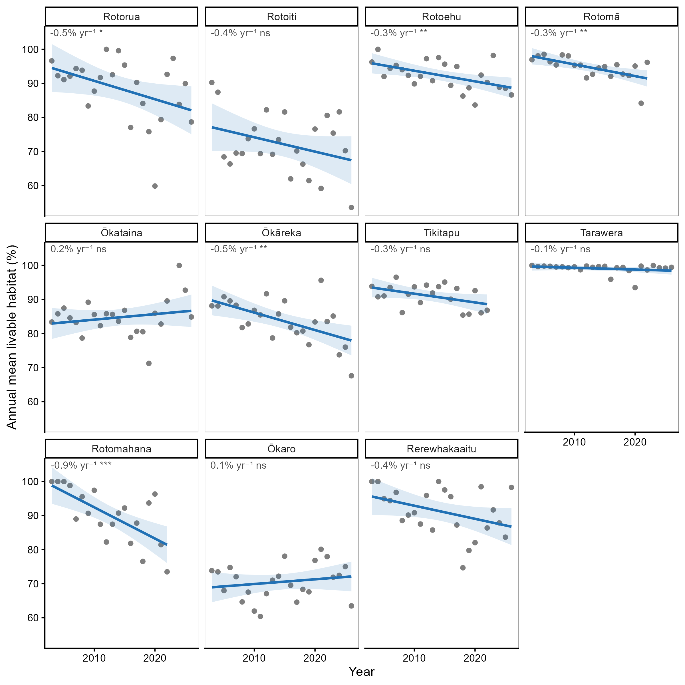

# Chapter 1: General Introduction
## Threats on aquatic ecosystems
Ecosystems around the world are impacted by drivers of global change and freshwater environments are amongst the most degraded [@Harrison2018]. Freshwater ecosystems like rivers, streams, and lakes experience pervasive influences from land-use activities, introduced species, and climate change [@Dudgeon2006]. This is concerning as these systems disproportionately support biodiversity and ecosystem services. In lakes, the littoral zone is characterised by its exposure to sunlight, which enables photosynthesis in plants and algae, making it one of the most productive and biodiverse areas in lakes [@Geist2016; @Porst2019; @Vadeboncoeur2011]. In the shallow regions of this zone, emergent vegetation flourishes, creating essential nurseries for numerous species [@Meerhoff2021]. This vegetation significantly contributes to the energy and nutrient cycles within lake food webs. Unfortunately, lake shorelines are often heavily impacted by human activities such as hardening, introduced species like, and pollution [@Strayer2010; @Vadeboncoeur2002]. Despite their importance, there is still limited understanding of the effects of eutrophication and predation by non-native species in the littoral zone. To prevent further degradation and to bend the curve on biodiversity loss, interventions are required but these can be difficult to implement and are often expensive [@Palmer2005].

## Ecosystem restoration
The UN declared 2020-2030 the decade for ecosystem restoration, with the intention of getting an hold on the degradation of ecosystems around the world [@UNGeneralAssembly2019]. Ecosystem restoration aims to recover an entire ecosystem including its structure, function and dynamics. Often, it focuses on enhancing the resilience of the ecosystem for future stressors. A part of ecosystem restoration is habitat restoration, this focuses on enhancing a specific habitat for a selected species. Examples of habitat restoration can include planting native vegetation or often in aquatic systems structures are added to create more variation [@BanksLeite2020; @Loch2020]. Enhancing habitat quality and quantity are common goals of aquatic habitat restoration, and one way this can be achieved in aquatic ecosystems is through the introduction of artificial reefs [@Geist2016; @Seaman2019]. Artificial reefs can help rehabilitate degraded habitats, promote biodiversity, and support recovery of aquatic ecosystems [@Kelch1999; @McLean2015].

## Habitat enhancement structures
A reef is a submerged ridge composed of rocks, corals, or other hard substrates that occur naturally and often creates biodiversity hotspots. Artificial reefs are man-made structures placed in aquatic environments to mimic natural reef or hard substrate habitats. These reefs can enhance biodiversity, fish productivity, and ecosystem resilience [@Seaman, 2019]. Artificial reef structures are designed to enhance habitat for organisms by creating attachment surfaces, providing shelter, and increasing habitat complexity. Artificial reefs come in various shapes, sizes, and materials, and they can be deployed in marine, lake, or river environments. The use of artificial reefs is mostly focused on marine habitats with examples including coral reef restoration and fish habitat to enhance fisheries [@BrachoVillavicencio2023; @Goergen2020; @Seaman2019]. An example of an artificially modified habitat is the creation of living seawalls using sea pods in Tauranga CBD [@Gillespie2024]. The sea pods will mimic rocky tidal pools keeping water even as the tides retreats and so create habitat for algae and invertebrates. In freshwater systems artificial reefs can have similar benefits by providing fish spawning habitats and provide shelter places for various species [@Creque2006].

## Freshwater crayfish
Freshwater crayfish are decapod crustaceans that form an importance component of benthic macro-invertebrate communities in a wide range of freshwater ecosystems. Freshwater crayfish are scientifically classified in the infraorder Astacidea consisting of 3 families: Astacidae, Cambaridae (also consisting of Cambaroididae), and Parastacidae [@Crandall2017]. The Astacidae and Cambaridae are found in the northern hemisphere, whereas the Parastacidae with 15 genera are naturally found only in the southern hemisphere (Figure 1). Crayfish have a segmented exoskeleton with chelipeds (pincers) for hunting and protection. They are omnivores and play an important ecological role as scavengers, predators, and prey [@Momot1995; @Reynolds2013]. They can also have a disproportionate impact on freshwater ecosystems through burrowing that changes sediment dynamics [@Statzner2003], their consumption and removal of macrophytes [@Nyström1996], and through processing organic matter as facultative detritivores [@Creed2004]. As a result, they are geomorphic agents that act as ecosystem engineers through bioturbation and contribute to nutrient cycling and trophic dynamics of food webs making them a keystone species [@Crandall2008; @Jones2016; @Nystrom1996]. Despite their significant role, 32 % of crayfish species worldwide are threatened with extinction [@Richman2015] due to numerous threats, including habitat degradation, pollution, invasive species, and overexploitation. Invasive species could be introduced non-native fish or crayfish preying on the native crayfish, competing for habitat, and spreading diseases [@Danilović2022]. For example, in Europe native crayfish (*Astacus astacus*, *Austropotamobius pallipes*, and *A. torrentium*) are susceptible and threatened by the crayfish plague fungus (*Aphanomyces astaci*) which is carried by many north American crayfish species [@Holdich2009]. Invasive crayfish also show more negative effects on the ecosystem compared to native crayfish [@Vaeßen2015]. Therefore, conservation efforts are necessary to help native crayfish populations and their ecosystems.

![Distribution of freshwater crayfish families around the world. From [@Fetzner2019].](images/....png){#...}

## Kōura
Aotearoa New Zealand’s (hereafter Aotearoa) native biota is disproportionately made up of endemic species because of its island biogeography and isolated location [@Wallis2009]. The two endemic species of freshwater crayfish found in Aotearoa are of the genus Paranephrops. These freshwater crayfish are also known by their common Māori name of kōura, although some iwi (tribes) use other names including kēwai, kēkēwai, and koeke. The two species are the northern kōura (*Paranephrops planifrons* White 1842) and the southern kōura (*P. zealandicus* White 1842). The northern kōura can be found all over the North Island and on the west side of the Southern Alps on the South Island (Figure 2). The southern kōura can be found on the eastern and southern part of the South Island and on Stewart Island.

{#...}

Kōura are recognized as keystone species [@Collier1997] and inhabit both streams and lakes. They tend to avoid areas with low dissolved oxygen (DO < 5 mg/L) [@Broughton2017] but have been observed in streams with a pH as low as 4.1 and calcium concentrations of 0.9 mg/L [@Olsson2006]. Kōura are sensitive to light greater than 150-205 lux and stay therefore in deeper parts of lakes or use shelters in shallower areas [@Devcich1979]. They can be found on all substrates but prefer complex habitats, such as coarse gravel or rocky substrates, which provide shelter. In streams, their highest abundance was recorded on substrates with an average length of 10 cm [@Olsson2008]. Kōura are omnivorous scavengers and consume a wide range of food resources including invertebrates (aquatic snails, chironomids, and mayflies) and detritus [@Parkyn2001]. During daylight hours, kōura are most vulnerable as prey for birds or other predators. Therefore, they will hide in shelters or in deeper parts of lakes during the day and move to shallower places during the night [@Coffey1988; @Devcich1979]. When natural substrates providing hiding places are rare, kōura can excavate tunnels or burrows to provide cover. This behaviour is only possible if the substrate is suitable like clay or pumice sand, such as in Lake Tikitapu where tunnelling behaviour has been observed. The life cycle of a kōura starts as an egg underneath the tail of its mother where it hatches to a juvenile. The juvenile stays under its mother’s tail for three weeks after which they are released. This mostly happens at less than 10 m depths in lakes [@Parkyn2007]. The juvenile kōura grows and moults several times and becomes mature in two to three years depending on the water temperature [@Parkyn2000].

Kōura continue to be an important food source for Māori and are considered a taonga (treasured) species [@Parkyn2007; @Kusabs2009]. Māori harvest kōura just like other kai (food) in specific periods of the year according to Maramataka (the lunar calendar) [@ManukaHenare]. For kōura, this period is from beginning of kōanga (spring) till halfway through ngahuru (autumn). Kōura are traditionally harvested using baited traps, handpicking, or the tau kōura which uses several whakaweku (fern bundles) attached to a tāuhu by pekapeka (Figure 3). In the Rotorua Te Arawa Lakes, kōura fisheries held significant cultural, economic, and nutritional importance. Historically, kōura were not only a vital food source but also served as a medium for trade and barter among the Te Arawa iwi and hapū. The tau kōura is still used today, but mostly for routine monitoring of kōura abundance in lakes [@Kusabs2009]. Kōura monitoring from 2005 to 2023 revealed 96 % declining kōura abundance in two of the Rotorua Te Arawa Lakes (Figure 4). This is likely the result of declining lake water quality in combination with the introduction of invasive species that include several macrophytes and brown bullhead catfish (*Ameiurus nebulosus*) [@Kusabs2009; @Kusabs2026].

{#...}
Figure 3: Two versions of the tau kōura as it can be used for harvesting kōura in a lake. © copyright Ian Kusabs.

![Kōura catches in CPUE of three sites in Lake Rotoiti between 2005 and 2023. Arrow indicates completion of  the Ōhau Channel diversion wall. Kōura were caught using the tau kōura. From [@Kusabs2026].](images/....png){#...}


## Brown bullhead catfish
The brown bullhead catfish (*Ameiurus nebulosus* Lesueur 1819, hereafter catfish) is native to North America but has been introduced for aquaculture and as a game fish all over the world. In New Zealand, 140 individuals were introduced in 1877 to Lake St John (Lake Waiatarua) [@Barnes1996]. This lake in the Auckland region has subsequently been drained but catfish have persisted. The initial goal was to introduce the channel catfish (*Ictalurus punctatus*) but by mistake the brown bullhead catfish was instead introduced. Since their introduction, catfish have spread throughout the upper North Island due to accidental and deliberate releases (Figure 2). This was also the case in Lake Taupō where catfish was first noticed in 1985 after illegal release [@Barnes1996]. In the Rotorua Te Arawa Lakes, a dead catfish was found at Okawa Bay in Lake Rotoiti in 2009, and sightings were reported in 2014. Surveys failed to detect catfish until 2016, when multiple catfish were found in several locations at the western end of Lake Rotoiti including Te Weta Bay where weed harvister found several catfish. From Lake Rotoiti they spread to Lake Rotorua in 2018 through the Ōhau channel. Since 2016, routine catfish monitoring, and active catfish fishing have been carried out to reduce the impact of this invasive exotic species.
Catfish are an omnivorous benthic bottom feeder ranging from 200-455 mm and can live up to 8 years [@Barnes1996]. Spawning happens in a nest around the size of the animal made in mud or sand under vegetation and close to a rock or tree trunks for protection [@Scott1973]. The nests are generally located in shallow areas of lakes. Females can carry 2000-13000 eggs depending on their size. Catfish are comparably tolerant animals and can withstand a wide range of temperatures and low oxygen levels [@Scott1973]. In lakes, they prefer to stay in the shallows to a depth of 17 m [@Dedual2002]. In Aotearoa, their diet overlaps or consist of native species leading to competition or reduction of these species. Catfish are also known predators of kōura and are therefore hold responsible for the decline in kōura numbers in Lakes Rotorua and Rotoiti (Figure 5) [@Kusabs2026]. Catfish can mostly be found in weedy or rocky habitats depending on the season [@Barnes1996]. In winter, most weeds are less abundant, and catfish are mostly found in rocky habitats. During autumn and spring, they can be found in both weedy and rocky areas [@Barnes2003]. 

{#catfish-dissection}

## Threats for kōura
In combination with predation by catfish kōura are further compressed by multiple interacting stressors that progressively restrict their available habitat. Kōura are naturally found in complex rocky habitats [@Jowett2008; @Kusabs2015b] or in deeper parts of the lake to avoid predation during the day, migrating to the productive littoral zone at night to forage [@Devcich1979]. However, thermal stratification creates anoxic conditions in deeper waters, displacing kōura into the shallow littoral zone [@Kusabs2026], precisely where catfish predation pressure is greatest, as catfish rarely swim beyond 18 m depth [@Dedual2002]. This compression is further intensified by dense invasive macrophyte beds obstructing kōura migration in the littoral zone [@Kusabs2009], which also intensify oxygen depletion in deeper waters by die-off events [@Vincent1984; @Hamilton2005]. 

The importance of deep refuge is shown by Lake Taupō, where catfish and kōura co-exist as the lake with a max depth of 110 m remains oxygenated below the thermocline thereby providing suitable habitat for kōura [@Verburg2019; @Kusabs2026]. In Lake Rotoiti this deep refuge becomes anoxic and unavailable for kōura [@Kusabs2026]. Next to direct predation catfish exposure triggers anti-predator responses in kōura including increased refuge use [@Raveninreviewa], reducing time available for foraging and potentially suppressing growth and reproduction [@Preisser2005; @Sheriff2020]. Climate change is expected to strengthen thermal stratification, expand anoxic zones [@Woolway2021], and increase the range of suitable catfish habitat in Aotearoa, further reducing kōura persistence [@Lee2025].

{#...}


{#...}


## Study area
This research will be executed in the Rotorua Te Arawa Lakes which are located in the central of the North Island of Aotearoa. This area is part of the central volcanic plateau in the Bay of Plenty region and consist of multiple lakes. The lakes were formed up to 230,000 years ago by volcanic eruptions (Cole2014). The lakes still experience volcanic influence, including the eruption of Mount Tarawera in 1886, covering the area with basalt scoria and Rotomāhana Mud. The Te Arawa and Bay of Plenty region includes twelve lakes: Rotorua, Rotoiti, Rotoehu, Rotomā, Ōkataina, Ōkāreka, Tarawera, Tikitapu, Rotokākahi, Rotomāhana, Ōkaro, and Rerewhakaaitu. The Te Arawa Lakes Trust (TALT) owns the lake beds of all these lakes except for Lake Rotokākahi, which is under the guardianship of Tuhourangi and Ngāti Tumatawera iwi. TALT, in collaboration with Te Komiti Whakahaere, developed a fisheries management plan to oversee the harvest of ngā taonga in the Te Arawa Lakes [@TALT2015].
These twelve lakes vary considerably in size (0.3 km² to 81 km²) and depth (13.5 m to 125 m) and exhibit diverse characteristics and water quality. Many lakes are popular for recreational boating and fishing. Most lakes contain introduced trout (*Salmo trutta* Linnaeus, 1758, *Oncorhynchus mykiss* (Walbaum, 1792)). Also present are other introduced species like catfish and goldfish (morihana, *Carassius auratus* (Linnaeus, 1758)), as well as species endemic to Aotearoa like kākahi (*Echyridella menziesii* (Gray, 1843)), kōaro (*Galaxias brevipinnis* Günther, 1866), bullies (toitoi,*Gobiomorphus cotidianus* McDowall, 1975), and common smelt (*Retropinna retropinna* (J. Richardson, 1848)). In the lakes are also several aquatic plants found both native  stoneworts (*Nitella* sp. C.Agardh), Three-leaved milfoil (*Myriophyllum triphyllum* Orchard), and Mudmat (*Glossostigma diandrum* (L.) Kuntze) and non-native / invasive, Canadian pondweed (*Elodea canadensis* Michx.), Oxygen weed (*Lagarosiphon major* (Ridl.) Moss) and (*Egeria densa* Planch.), Hornwort (*Ceratophyllum demersum* L.), Curly-leaf pondweed (*Potamogeton crispus* L.), and (*Ludwigia repens* J.R.Forst)(figure...). 


The lakes and their species are threatened by climate change, reduced water quality as a result of catchment land use, and invasive species such as hornwort (Ceratophyllum demersum) and other aquatic weeds, which often create anoxic zones in shallow areas. Current management efforts are focused on improving water quality and controlling invasive species. Strategies include dosing Lakes Rotorua and Ōkaro with aluminium phosphate to reduce phosphorus levels, spraying or harvesting invasive weeds, and implementing a c

```{r}
#| label: tbl-lake-overview

lake_data <- data.frame(
  `Lake name` = c("Rotorua", "Rotoiti", "Rotoehu", "Rotomā", "Ōkataina", "Ōkāreka", "Tikitapu", "Rotokākahi", "Tarawera", "Rotomahana", "Ōkaro", "Rerewhakaaitu"),
  `Surface area (km²)` = c(81, 34, 8, 11, 11, 3, 1, 4, 41, 9, 0.3, 5),
  `Perimeter length (km)` = c(45, 61, 40, 24, 29, 11, 5, 16, 48, 27, 2, 25),
  `Catchment area (km²)` = c(508, 123.7, 49.2, 27.8, 59.8, 19.6, 6.2, NA, 143.1, 83.3, 3.9, 37),
  `Mean depth (m)` = c(11, 31.5, 8, 36.9, 39.4, 20, 18, 17.5, 50, 60, 12.5, 7),
  `Maximum depth (m)` = c(45, 124, 13.5, 83, 78.5, 33.5, 27.5, 32, 87.5, 125, 18, 15.8),
  `Elevation (m)` = c(280, 279, 295, 316, 305, 355, 355, 395, 305, 340, 280, NA),
  `Mixing regime` = c("Polymictic", "Monomictic", "Polymictic", "Monomictic", "Monomictic", "Monomictic", "Monomictic", "Monomictic", "Monomictic", "Monomictic", "Monomictic", "Polymictic"),
  `Trophic state` = c("Eutrophic", "Mesotrophic", "Eutrophic", "Oligotrophic", "Oligotrophic", "Mesotrophic", "Oligotrophic", "Mesotrophic", "Mesotrophic", "Mesotrophic", "Super-trophic", "Mesotrophic"),
  check.names = FALSE
)

knitr::kable(lake_data)

```


## Problem statement
The kōura populations in Lake Rotoiti (since 2005) and Lakes Rotorua, Rotomā, Rotokākahi, Ōkāreka, Tarawera, and Ōkaro (since 2009) have been monitored using a tau kōura (Kusabs, Hicks,2015). This monitoring has shown a steep decline in kōura abundance in Lakes Rotorua and Rotoiti, and an absence of kōura in Lake Ōkaro. This decline is due to multiple stressors, including reduced water quality, eutrophication leading to anoxic zones in bottom waters, and a rapid growth of exotic macrophytes that obstruct movement and produce organic detritus, further exacerbating anoxic zones. Additionally, predation by catfish has significantly contributed to the decline in Lakes Rotorua and Rotoiti (Kusabs, 2026). Current conservation and restoration efforts are insufficient to counteract these cumulative threats, and innovative solutions are urgently needed to protect and enhance kōura habitat quantity and quality. This research aims to explore the potential of artificial reefs in mitigating these stressors to enhance kōura populations in these lakes.

## Scope & Aims
This PhD research aims to identify optimal strategies for enhancing kōura populations in the Rotorua Te Arawa Lakes through the deployment of artificial reefs. When shelter availability is a limiting factor for kōura abundance, the provision of artificial reefs in the littoral zone can be expected to enhance habitat quality and quantity, providing refuge from predators and facilitating population growth. As kōura are a keystone species, supporting their populations will also benefit a range of co-occurring species that inhabit and rely on the lakes. To achieve this, I seek to determine the most effective artificial reef designs and optimal deployment locations for restoration efforts.

This research anticipates that the deployment of artificial reefs in Lake Rotoiti will yield a significant increase in kōura survival and abundance. As artificial reefs provide shelter from invasive catfish predation, kōura numbers and biomass are expected to increase on artificial reefs compared to natural habitats. Furthermore, kōura survival rates are predicted to improve on artificial reefs, and the size distribution of kōura on these reefs is expected to increase, indicating a healthy population with juveniles and sub-adults.
A key component of this PhD research is to develop artificial reef design criteria to avoid unintended consequences of poorly designed reefs. For instance, artificial reefs may inadvertently provide habitat for invasive catfish, potentially exacerbating kōura decline. Additionally, artificial reefs may fail to suppress invasive macrophytes or even enhance their growth, leading to further degradation of kōura habitat. Moreover, artificial reefs may trap sediment and debris, leading to anoxic zones and potentially replacing more suitable habitat. These outcomes will be monitored and evaluated to assess the effectiveness and optimal design criteria of artificial reefs.

## Research questions
The decline of kōura populations in the Rotorua Te Arawa Lakes has raised concerns about the long-term sustainability of this culturally and ecologically significant species. Habitat restoration using artificial reefs has been proposed as a potential solution. To address the knowledge gaps outlined above, this research aims to investigate the following questions:

1.	Can artificial rock reefs enhance kōura populations in the Rotorua Te Arawa Lakes?
2.	How can habitat restoration using artificial reefs benefit crayfish? A literature review.
3.	What are the preferred natural shoreline habitats for kōura?
4.	What artificial reefs designs are preferred by kōura?
5.	What is the effect of artificial rock reefs in the littoral zone of a small-monomictic eutrophic lake (Lake Ōkaro)?

## Thesis Structure
The five research questions will support each other to work towards the goals of this PhD (Figure 7). After this introduction, chapter 2 will describe how the first question will be answered. In chapter 2 twelve artificial reefs will be built on 4 locations in Lake Rotoiti to improve kōura habitat. The development of the reefs will be followed with seasonal monitoring. Chapter 3 comprises a literature review document the existing literature on habitat restoration using artificial reefs, with particular emphasis on the benefits for freshwater crayfish. The knowledge acquired from the literature review will be used to inform aspects of the following chapters. Chapter 4 and question 3 will determine the preferred natural shoreline habitats for kōura in the Rotorua Te Arawa Lakes. This will be done by implementing a monitoring programme to map the available natural habitats and which habitats would benefit from improvement using artificial reefs. Chapter 5 and question 4 will be assessed in a mesocosm experiment to examine the preferred artificial reef designs for kōura. Chapter 6 and question 5 will address the habitat quality of artificial reefs in Lake Ōkaro, a lake where water quality has been a limiting factor for the presence of kōura.
