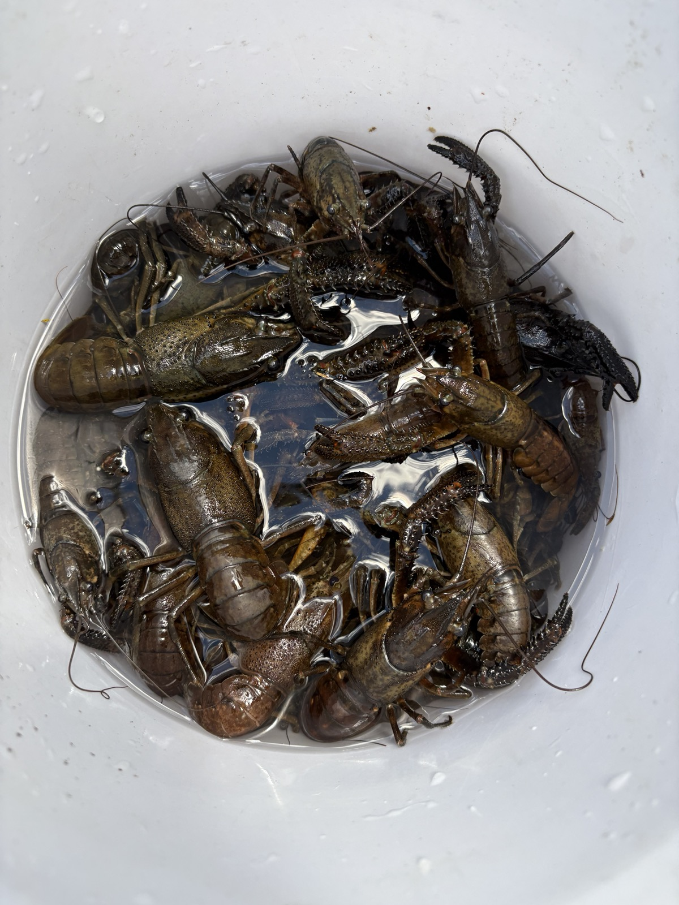
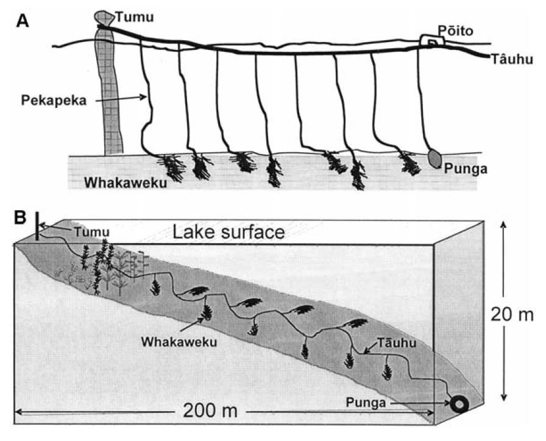
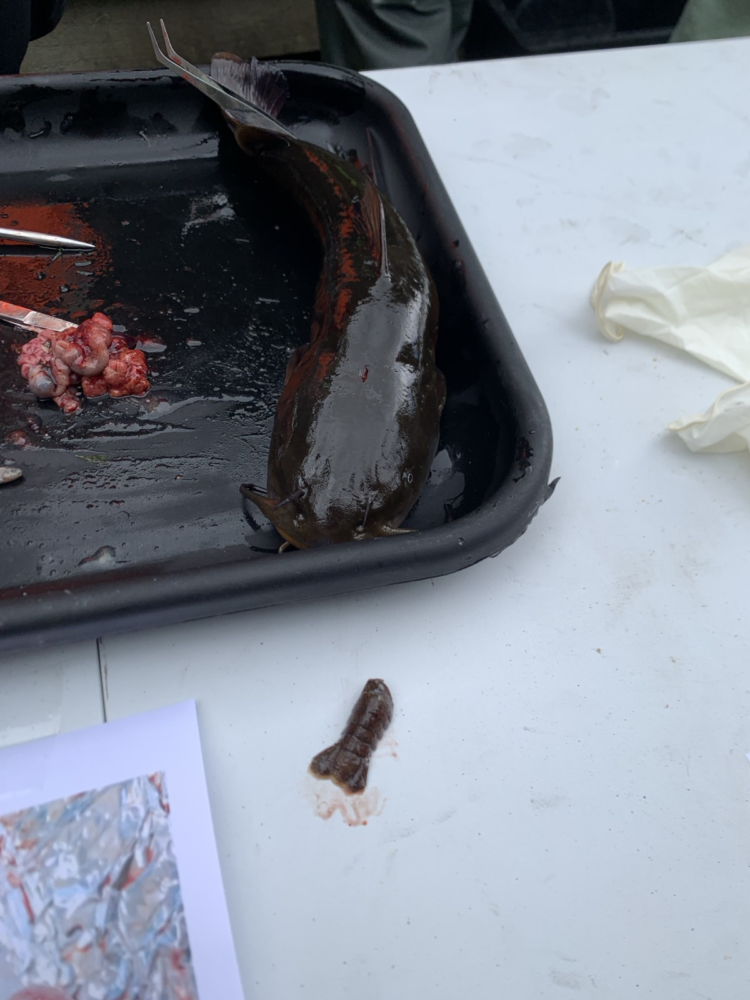
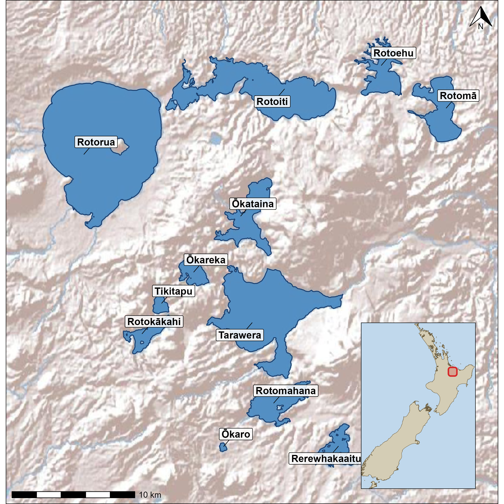
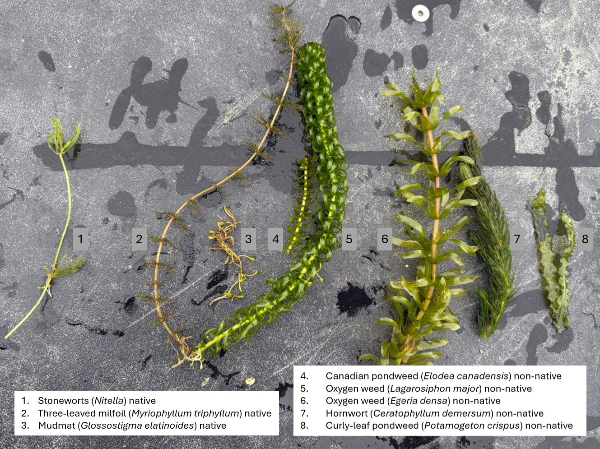

::: {.content-visible when-format="pdf"}
\clearpage
\thispagestyle{empty}
\AddToShipoutPictureBG*{\AtPageUpperLeft{\includegraphics[width=\paperwidth,height=\paperheight]{images/ch1_cover.jpg}}}
\null
\newpage
\afterpage{\pagecolor{thesiscream}}
\clearpage
:::

::: {.content-visible when-format="html"}
{fig-align="center" width="100%"}
:::

::: {.content-visible when-format="docx"}
{fig-align="center" width=15cm}


:::

# General Introduction
## Global freshwater ecosystem decline
Ecosystems worldwide are increasingly impacted by drivers of global change, with freshwater environments amongst the most degraded [@Harrison2018]. Freshwater ecosystems like rivers, streams, and lakes experience widespread influences from land-use activities, introduced species, and climate change [@Dudgeon2006]. This degradation is particularly concerning given that freshwater systems disproportionately support biodiversity and ecosystem services relative to their global area. In lakes, the littoral zone is characterised by its exposure to sunlight, which enables photosynthesis in plants and algae, making it one of the most productive and biodiverse areas in lakes [@Geist2016; @Porst2019; @Vadeboncoeur2011]. In the shallow regions of this zone, emergent vegetation flourishes, creating essential nurseries for numerous species [@Meerhoff2021]. This vegetation significantly contributes to the energy and nutrient cycles within lake food webs. Unfortunately, lake shorelines are often heavily impacted by human activities such as hardening, the introduction of invasive species, and pollution [@Strayer2010; @Vadeboncoeur2002]. Despite their importance, the effects of eutrophication and predation by non-native species in the littoral zone remain relatively understudied [@VanderZanden2020]. Reversing this degradation requires targeted interventions, though these are often complex and resource-intensive [@Palmer2005], a challenge that has driven recent global commitments to ecosystem restoration.

## Ecosystem and habitat restoration
The UN declared 2020-2030 the Decade for Ecosystem Restoration, with the intention of halting the degradation of ecosystems around the world [@Gann2019; @UNGeneralAssembly2019; @Cooke2022], as habitat degradation and loss remain key drivers of regional population extinction [@Heinrichs2016]. Ecosystem restoration aims to recover an entire ecosystem including its structure, function and dynamics, often focussing on enhancing resilience to future stressors. Habitat restoration is a more targeted component of this broader goal, focusing on enhancing the quality or availability of habitat for a specific species or community, rather than an entire ecosystem. Approaches to habitat restoration vary widely depending on the system and species involved, but commonly include actions such as replanting native vegetation, removing barriers like dams, or adding structure to a habitat that has become structurally simplified or degraded [@BanksLeite2020; @Loch2020]. Adding structure is one of the more direct and widely applied forms of habitat restoration, since many species depend on physical complexity in their environment for shelter, feeding or reproduction [@Geist2016]. In marine systems, this principle is most visibly applied through artificial reefs, structures placed on the seafloor to rebuild the complexity lost from degraded or removed natural reef habitat, supporting biodiversity recovery and fisheries productivity [@Frehse2025]. While artificial reefs are most often associated with marine environments but the same principle that adding physical structure to a degraded habitat can restore the complexity and shelter availability, extends to freshwater systems as well [@Geist2016]. In freshwater environments, this principle has been applied through the addition of rock, woody debris, or other natural substrates to streams and lakes that have lost structural complexity through historic modification, sedimentation, or substrate removal [@Smokorowski2007; @Roni2008]. These additions have been used to support a range of freshwater taxa, including fish and invertebrates, by recreating the kind of structurally complex habitats that naturally support shelter, feeding and reproduction [@Santos2011; @McLean2015; @Zhu2021]. However, not all added structures achieve their intended benefit, poorly designed or inappropriate materials such as plastic habitat structures can fail to replicate natural habitat function and risk becoming a form of littering rather than restoration [@Baine2001; @Cooke2023], underscoring the importance of careful design when structures are used as a restoration tool. Within freshwater systems, structural restoration is particularly relevant for taxa that depend on physical complexity for shelter, including freshwater crayfish, a group of significant ecological and conservation importance globally and one facing severe declines across much of its range.

## Freshwater crayfish: ecology and global decline
Freshwater crayfish are decapod crustaceans that form an important component of benthic macroinvertebrate communities in a wide range of freshwater ecosystems. They belong to the infraorder Astacidea, which is divided into two superfamilies: Astacoidea, restricted to the Northern Hemisphere, and Parastacoidea, restricted to the Southern Hemisphere [@Crandall2017]. The Astacoidea contains three families, Astacidae (western Eurasia and western North America), Cambaridae (eastern North America), and Cambaroididae (eastern Asia), while the Parastacoidea contains a single family, Parastacidae, with 15 genera distributed across Australia, New Zealand, New Guinea, South America, and Madagascar (@fig-crayfish-distribution) [@Crandall2017]. Crayfish have a segmented exoskeleton with chelipeds (pincers) for hunting and protection. They are omnivorous, functioning as scavengers, predators, and prey within freshwater food webs [@Momot1995; @Reynolds2013]. Through burrowing, bioturbation, sediment reworking, macrophyte consumption, and the processing of organic matter, crayfish exert disproportionate effects on freshwater ecosystems [@Creed2004; @Nystrom1996; @Statzner2003], making them important ecosystem engineers and, in some systems, keystone species [@Crandall2008; @Jones2016]. Despite their significant role, 32 % of crayfish species worldwide are threatened with extinction [@Richman2015] due to numerous threats, including habitat degradation, pollution, invasive species, and overexploitation. Invasive species, including non-native fish and crayfish, prey on native species, compete for habitat, and spread diseases [@Danilovic2022]. For example, in Europe native crayfish such as *Astacus astacus*, *Austropotamobius pallipes*, and *A. torrentium* are threatened by the crayfish plague pathogen (*Aphanomyces astaci*, an oomycete), which is carried asymptomatically by many North American crayfish species [@Holdich2009]. These combined pressures mean that conservation of native crayfish requires understanding not only the threats they face but also the habitats they depend on, a challenge particularly acute for endemic species in geographically isolated systems such as those of Aotearoa New Zealand.

![Global distribution of freshwater crayfish families. Note: the eastern Asian populations shown here in green (Japan, Korea, eastern Russia) are now classified as a separate family, Cambaroididae, following @Crandall2017. Source: [@Fetzner2019].](images/fig-crayfish-distribution.png){#fig-crayfish-distribution}

## Kōura: Aotearoa's native freshwater crayfish
Aotearoa New Zealand’s (hereafter Aotearoa) native biota is disproportionately made up of endemic species because of its island biogeography and isolated location [@Wallis2009]. The two endemic species of freshwater crayfish found in Aotearoa are of the genus *Paranephrops*. These freshwater crayfish are also known by the Māori name kōura, although some iwi (Māori tribal groups) use other names including kēwai, kēkēwai, and koeke. The two species are the northern kōura (*Paranephrops planifrons* White 1842) and the southern kōura (*P. zealandicus* White 1847). The northern kōura can be found throughout the North Island and on the west side of the Southern Alps on the South Island (@fig-nz-distribution-maps). The southern kōura can be found on the eastern and southern part of the South Island and on Stewart Island.

![Distribution of kōura (blue left) and catfish (red right) in Aotearoa New Zealand. Source: New Zealand Freshwater Fish Database [@Stoffels2024]](images/fig-nz-distribution-maps.png){#fig-nz-distribution-maps}

### Biology, ecology, and habitat use
Kōura inhabit a range of freshwater environments including streams, rivers and lakes and have been described as ecosystem engineers and keystone species in Aotearoa [@Collier1997]. They play important roles in bioturbation, influencing sediment composition and nutrient cycling [@Usio2004]. As omnivorous scavengers, kōura consume a wide range of food resources including invertebrates (aquatic snails, chironomids, and mayflies), detritus, and algae [@Parkyn2001]. Kōura are associated with structurally complex habitats that provide physical shelter, preferring coarse gravel and rocky substrates in both streams and lakes [@Jowett2008; @Kusabs2015b]. In streams, highest abundances have been recorded on substrates with an average particle size of 130 mm [@Jowett2008; @Olsson2008]. Kōura are sensitive to water quality [@Olsson2006], avoiding areas with dissolved oxygen below 5 mg/L and temperatures above 21 °C [@Devcich1979]. Kōura are nocturnal, and during the daylight hours they retreat to deeper waters or into shelters, to hide from visual predators. At night they emerge and migrate to forage in the productive shallow zones of lakes [@Devcich1979]. Where suitable natural substrates are rare, kōura can excavate tunnels or burrows to provide cover, a behaviour documented in Lake Tikitapu, where substrate permits burrowing. Kōura have direct development with females carrying eggs and newly hatched juveniles beneath the abdomen for approximately three weeks before release, typically at depths of less than 10 m in lakes [@Parkyn2007]. Juveniles mature in two to three years depending on water temperature [@Devcich1979; @Parkyn2000].

### Cultural significance and population decline
Kōura continue to be an important food source for Māori and are considered a taonga (treasured) species [@Parkyn2007; @Kusabs2009]. Māori harvest kōura alongside other kai (food) in specific periods of the year according to Maramataka (the Māori lunar calendar) [@ManukaHenare2008]. For kōura, this period is from beginning of kōanga (spring) until halfway through ngahuru (autumn). Kōura are traditionally harvested using baited traps, handpicking, or the tau kōura which uses several whakaweku (fern bundles) attached to a tāuhu by pekapeka (@fig-tau-koura) [@Parkyn2007; @Kusabs2009]. In the Rotorua Te Arawa Lakes (a group of twelve volcanic lakes in the central North Island, see Study system below), kōura fisheries held significant cultural, economic, and nutritional importance. Historically, kōura were not only a vital food source but also served as a medium for trade and barter among the Te Arawa iwi and hapū. The tau kōura is still used today, but mostly for routine monitoring of kōura abundance in lakes [@Kusabs2009; @Kusabs2018]. Kōura monitoring from 2005 to 2025 revealed declines of 76 % and 91 % in kōura catch-per-unit-effort in Lakes Rotorua and Rotoiti respectively (@fig-koura-decline). This is likely the result of the introduction of invasive predatory species like the brown bullhead catfish (*Ameiurus nebulosus*) [@Kusabs2026].

{#fig-tau-koura}

![Kōura catches in CPUE in Lake Rotoiti between 2005 and 2025. Kōura were caught using the tau kōura. Adapted from [@Kusabs2026].](images/fig-koura-decline.png){#fig-koura-decline}

## Brown bullhead catfish: a novel predator in Aotearoa lakes
The brown bullhead catfish (*Ameiurus nebulosus* Lesueur 1819, hereafter catfish) is native to North America but has been introduced worldwide for aquaculture and as a game fish. In Aotearoa, 140 individuals were introduced in 1877 to Lake St John (Lake Waiatarua) in the Auckland region, reportedly by mistake, as the intended species was channel catfish (*Ictalurus punctatus*) [@Barnes1996]. Although Lake St John has since been drained, catfish persisted and have spread throughout the upper North Island via accidental and deliberate releases (@fig-nz-distribution-maps). Lake Taupō was first invaded in 1985 following an illegal release [@Barnes1996]. In the Rotorua Te Arawa Lakes, a dead catfish was found at Okawa Bay in Lake Rotoiti in 2009 [@Blair2009] and sightings followed in 2014, but surveys failed to detect catfish until 2016, when multiple individuals were found at the western end of Lake Rotoiti, including Te Weta Bay where catfish were recovered during macrophyte harvesting operations [@Francis2019]. Catfish subsequently spread to Lake Rotorua in 2018 via the Ōhau Channel. Since 2016, routine monitoring and active control fishing have been carried out to reduce their impact [@Grayling2020]. 

Critically, Aotearoa lacks native Siluriformes, making catfish a novel predation threat to which native species may lack adequate behavioural or sensory adaptations [@Sih2010; @Carthey2014]. Catfish are physiologically tolerant of a wide range of conditions, including elevated temperatures and low dissolved oxygen [@Scott1973], allowing them to occupy habitats that exclude many native species [@Lee2025]. They are omnivorous benthic feeders, with individuals reaching 200-455 mm in length and living up to eight years [@Barnes1996]. Their diet overlaps with, and partly consists of, native species leading to both competition and direct predation (@fig-catfish-dissection) [@Scott1973; @Dedual2019]. Catfish are known predators of kōura, and are held responsible for the recent decline in kōura abundance in Lakes Rotorua and Rotoiti (@fig-koura-decline) [@Kusabs2026]. Habitat use varies seasonally: in lakes, catfish occupy depths down to approximately 17 m [@Dedual2002] and shift between weedy and rocky habitats depending on the season, primarily rocky habitats in winter when macrophytes die back, and both habitat types during autumn and spring [@Barnes1996; @Barnes2003]. Spawning occurs in nests excavated in mud or sand, typically in shallow areas near rocks or submerged tree trunks for protection [@Scott1973]. Nests are roughly the size of the female, who may carry between 2,000 and 13,000 eggs depending on body size [@Scott1973].

{#fig-catfish-dissection}

## Study system: the Rotorua Te Arawa Lakes
This research was conducted in the Rotorua Te Arawa Lakes, a group of twelve volcanic lakes in the central North Island of Aotearoa (Bay of Plenty region;@fig-study-lakes-map ;@tbl-bop-lake-overview). The lakes were formed by rhyolitic volcanic activity over the past ~230,000 years and continue to experience volcanic influence, most recently through the 1886 eruption of Mount Tarawera, which deposited basalt scoria and the distinctive Rotomāhana Mud across the surrounding catchments [@Cole2014]. The lakes vary considerably in size (0.3-81 km²) and maximum depth (13.5-125 m), and span a gradient of mixing regimes and trophic states from oligotrophic (e.g. Tarawera, Rotomā) to eutrophic (e.g. Rotorua, Ōkaro; @tbl-bop-lake-overview). This diversity makes the Te Arawa Lakes a particularly informative system for studying how kōura respond to differing combinations of habitat structure, water quality, and predator presence.

{#fig-study-lakes-map}

```{r}
#| label: tbl-bop-lake-overview
#| tbl-cap: "Physical and limnological characteristics of the twelve Rotorua Te Arawa lakes. Data sourced from @LAWA2025. Lakes Ōkaro and Rotomahana do not have kōura populations"
#| echo: false

lake_data <- data.frame(
  `Lake name` = c("Rotorua", "Rotoiti", "Rotoehu", "Rotomā", "Ōkataina", "Ōkāreka", "Tikitapu", "Rotokākahi", "Tarawera", "Rotomahana", "Ōkaro", "Rerewhakaaitu"),
  `Surface area (km²)` = c(81, 34, 8, 11, 11, 3, 1, 4, 41, 9, 0.3, 5),
  `Perimeter length (km)` = c(45, 61, 40, 24, 29, 11, 5, 16, 48, 27, 2, 25),
  `Catchment area (km²)` = c(508, 123.7, 49.2, 27.8, 59.8, 19.6, 6.2, 18.7, 143.1, 83.3, 3.9, 37),
  `Mean depth (m)` = c(11, 31.5, 8, 36.9, 39.4, 20, 18, 17.5, 50, 60, 12.5, 7),
  `Maximum depth (m)` = c(45, 124, 13.5, 83, 78.5, 33.5, 27.5, 32, 87.5, 125, 18, 15.8),
  `Elevation (m)` = c(280, 279, 295, 316, 305, 355, 355, 395, 305, 340, 280, NA),
  `Mixing regime` = c("Polymictic", "Monomictic", "Polymictic", "Monomictic", "Monomictic", "Monomictic", "Monomictic", "Monomictic", "Monomictic", "Monomictic", "Monomictic", "Polymictic"),
  `Trophic state` = c("Eutrophic", "Mesotrophic", "Eutrophic", "Oligotrophic", "Oligotrophic", "Mesotrophic", "Oligotrophic", "Mesotrophic", "Oligotrophic", "Mesotrophic", "Eutrophic", "Eutrophic"),
  check.names = FALSE
)

knitr::kable(lake_data)

```

The lake beds are owned by the Te Arawa Lakes Trust (TALT), with the exception of Lake Rotokākahi, which remains under the guardianship of Tuhourangi and Ngāti Tumatawera iwi. TALT, in collaboration with Te Komiti Whakahaere, oversees the harvest of ngā taonga in the Te Arawa Lakes under a fisheries management plan [@TALT2015], reflecting the deep cultural and ecological significance of the lakes to Te Arawa iwi and hapū. 

Each lake supports a mix of native and introduced species. Alongside kōura and catfish discussed above, native taxa include the freshwater mussel kākahi (*Echyridella menziesii*), kōaro (*Galaxias brevipinnis*), bullies toitoi (*Gobiomorphus cotidianus*), and common smelt (*Retropinna retropinna*). Introduced species include brown and rainbow trout (*Salmo trutta*, *Oncorhynchus mykiss*) and goldfish morihana (*Carassius auratus*). The lakes also support a mix of native macrophytes and several invasive species that have transformed the littoral zone in many lakes (@fig-rotoiti-weeds). Current lake management focuses on improving water quality and controlling invasive species, including alum (aluminium sulphate) dosing in Lakes Rotorua and Ōkaro to reduce phosphorus loading, mechanical and chemical control of invasive macrophytes, and the community-led catfish elimination programme known as the "Catfish Killas". 

{#fig-rotoiti-weeds}

## Compounding threats to kōura habitat 
In addition to predation by catfish, kōura face multiple interacting stressors that progressively restrict the habitat available to them [@Kusabs2015a; @Lee2025]. Kōura are naturally found in more rocky habitats [@Jowett2008; @Kusabs2015b] or in deeper parts of the lake which provides refuge from visual predators during daylight hours. At night, kōura migrate vertically into the productive littoral zone to forage [@Devcich1979]. The use of both shallow and deep habitats means that, for kōura to thrive, both must remain accessible and habitable. In stratified lakes during summer and autumn, thermal stratification can create anoxic conditions below the thermocline, displacing kōura from their daytime deep refuge into the shallow littoral zone [@Kusabs2026]. Kōura avoid dissolved oxygen concentrations below 5 mg L⁻¹ [@Devcich1979], and thermal stratification can force upward displacement, places kōura in the depth range where catfish predation pressure is greatest as catfish rarely occur below 17 m [@Dedual2002]. The result is a seasonal compression of available habitat, where suitable depths shrink precisely where predation risk is highest. The importance of an oxygenated deep refuge is illustrated by Lake Taupō (maximum depth 186 m), where catfish and kōura co-exist because deep waters remain oxygenated below the thermocline year-round, providing continuous suitable habitat for kōura [@Verburg2019; @Kusabs2026]. In Lake Rotoiti, this deep refuge becomes anoxic and unavailable for kōura [@Kusabs2026].

The shallow refuge available to kōura is also is also being progressively reduced as lake surface water temperatures increase above the kōura optimal temperature threshold of 21 °C [@Devcich1979]. Furthermore, dense beds of invasive macrophytes obstruct kōura movement through the littoral zone and reduce access to foraging habitat [@Kusabs2009]. When these macrophyte beds collapse, the subsequent decomposition further intensifies oxygen depletion in deeper waters [@Vincent1984; @Hamilton2005]. The shallow zone is therefore both structurally altered and contributes to the loss of deep refuge. The cumulative effect of these stressors can be visualised by estimating the proportion of each lake's water column that remains "livable" meaning sufficiently oxygenated and within thermal tolerance for kōura. Across eleven of the Rotorua Te Arawa Lakes, livable habitat varies strongly with season, with sharp summer declines in eutrophic and shallow lakes such as Rotorua, Rotoiti, Ōkaro, and Rotomahana, while deeper oligotrophic lakes such as Rotomā, Tarawera, and Tikitapu remain relatively stable year-round (@fig-livable-habitat-summary). OOver the past ~20 years several lakes show statistically significant declines in annual mean livable habitat, with Rotorua and Ōkāreka declining -0.5 % yr⁻¹ (@fig-livable-habitat-trends). 

Climate change is expected to intensify all of these pressures. Stronger and longer thermal stratification will expand and prolong anoxic conditions below the thermocline [@Woolway2021], while warming surface waters are projected to expand the range of suitable catfish habitat in Aotearoa [@Lee2025]. The compression of suitable kōura habitat documented here is therefore likely to accelerate, reinforcing the need to understand which habitats kōura prefer and whether structural restoration can build resilience in kōura populations.

{#fig-livable-habitat-summary}

![Long-term trends in annual mean livable habitat for kōura across eleven of the Rotorua Te Arawa Lakes. Livable habitat is defined as the proportion of the water column meeting dissolved oxygen (> 5 mg L⁻¹) and temperature (< 21 °C) thresholds suitable for kōura. Points represent annual means; blue lines show linear regressions with 95 % confidence intervals. Slopes are reported as percentage change per year (significance: *** p < 0.001, ns = not significant). Derived from CTD cast data collected by BOPRC monthly monitoring and monitoring buoy data @Moore2026.](images/fig-livable-habitat-trends.png){#fig-livable-habitat-trends}

## Knowledge gaps and thesis aims
The previous sections established that kōura populations in the Rotorua Te Arawa Lakes are declining, that this decline is driven by interacting pressures from invasive predation, eutrophication, thermal stratification, and macrophyte expansion, and that the suitable habitat for kōura is both seasonally compressed and progressively shrinking [@Kusabs2026]. Although the broad drivers of decline are increasingly well understood, several critical gaps remain in our ability to design effective interventions. First, while catfish are implicated as a primary driver of kōura decline, the effect catfish have on kōura behaviour leading to non-consumptive effects in comparison with native predators had not been quantified. We expected that kōura would show stronger antipredator responses to the novel catfish than to native eels, consistent with generalised fear response [@Sih2023]. Second, the natural habitats that kōura prefer had been described in streams and deeper parts of lakes but which shoreline habitat features kōura prefer remained unknown. We expected that rocky substrates with high structural complexity would be the primary predictor of kōura presence, consistent with stream habitat studies [@Jowett2008; @Olsson2008]. Third, although habitat enhancement structures had been applied in freshwater systems globally to support fish and invertebrates [@Smokorowski2007; @Santos2011], few studies had tested which combinations of material and structural configuration best support crayfish specifically. We expected that configurations providing multiple crevices of varying sizes would be preferred by the widest range of kōura, including juveniles. Finally, no field deployments of habitat enhancement structures for kōura in lakes had previously been reported. Therefore, we deployed stone piles in Lake Rotoiti and expected that kōura populations at the stone piles would increase, as providing more refuge habitat would allow more kōura to avoid predators. A secondary aim of the final study was to identify potential unintended consequences of habitat enhancement, including the risk that structures may provide refuge for catfish. This thesis addresses each of these gaps in turn through four research chapters, building from behavioural mechanisms in controlled conditions, through natural habitat use, to structure design, and finally to field deployment. 

## Research questions and thesis structure
This thesis aimed to determine optimal strategies for restoring and enhancing kōura populations in the Rotorua Te Arawa Lakes through habitat enhancement. The findings of this thesis are reported in the following four research chapters, followed by a general conclusion (@tbl-research-questions). 

| RQ | Chapter | Research question |
|:--:|:--------|:-------------------|
| 1 | 2 — Native vs. Novel Threats | How do native and non-native predators differentially influence antipredator behaviour and refuge use in kōura? |
| 2 | 3 — Where do Kōura Live | Which natural shoreline features do kōura prefer? |
| 3 | 4 — Structure over Material | Does shelter structure or material composition drive kōura refuge selection? |
| 4 | 5 — Stone Piles Rotoiti | Can habitat enhancement structures provide effective habitat for kōura in Lake Rotoiti? |

: Research questions addressed in each thesis chapter. {#tbl-research-questions}

Before the deployment of any structures, it was first necessary to understand the response of kōura when exposed to native and novel predators. Therefore in **Chapter 2**, kōura were exposed to native eels and to novel catfish in an aquarium study where refuge use was analysed. In **Chapter 3**, the natural preferred shoreline habitat for kōura was investigated by monitoring 60 sites over five lakes. From this we gained a clearer picture of which habitat features support kōura and which shoreline areas would most benefit from structural enhancement.

In the next chapter, **Chapter 4**, we designed and tested shelter types to determine kōura preference. Kōura are known to use various materials and compositions, so for this study we tested different configurations of wood and stone structures in mesocosm experiments to determine kōura shelter preferences. With an optimal design identified, **Chapter 5** deployed five stone pile structures along the shoreline in Lake Rotoiti and monitored kōura colonisation and abundance development over 18 months. Finally, the **General Conclusion** presents an overview of the findings and considers how structural habitat restoration can contribute to building resilience in declining freshwater crayfish populations more broadly. As each of the four chapters is written as a stand-alone manuscript, some overlap of background information and methods is unavoidable. However, the general introduction provides a comprehensive overview of the study system, the species involved, and the research questions addressed in this thesis.

