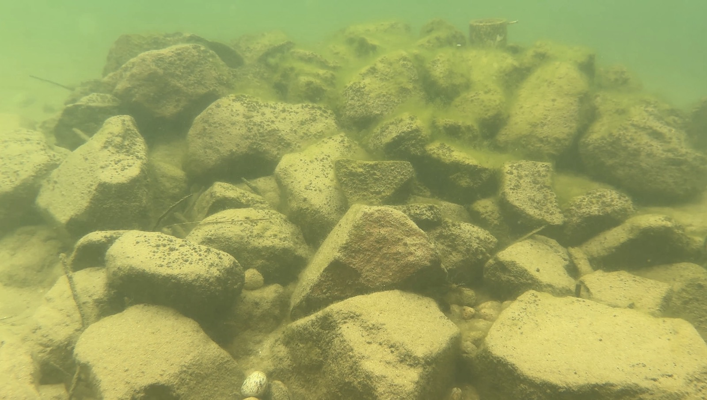

::: {.content-visible when-format="pdf"}
\clearpage
\thispagestyle{empty}
\AddToShipoutPictureBG*{\AtPageUpperLeft{\includegraphics[width=\paperwidth,height=\paperheight]{images/ch6_cover.jpg}}}
\null
\newpage
\thispagestyle{empty}
\pagecolor{thesissand}
\vspace{1cm}
\begin{center}
\textit{What do these findings mean for the future of kōura habitat restoration?}
\end{center}
\afterpage{\pagecolor{thesiscream}}
\clearpage
:::

::: {.content-visible when-format="docx"}
{fig-align="center" width=15cm}

*What do these findings mean for the future of kōura habitat restoration?*


:::

# General Conclusion
