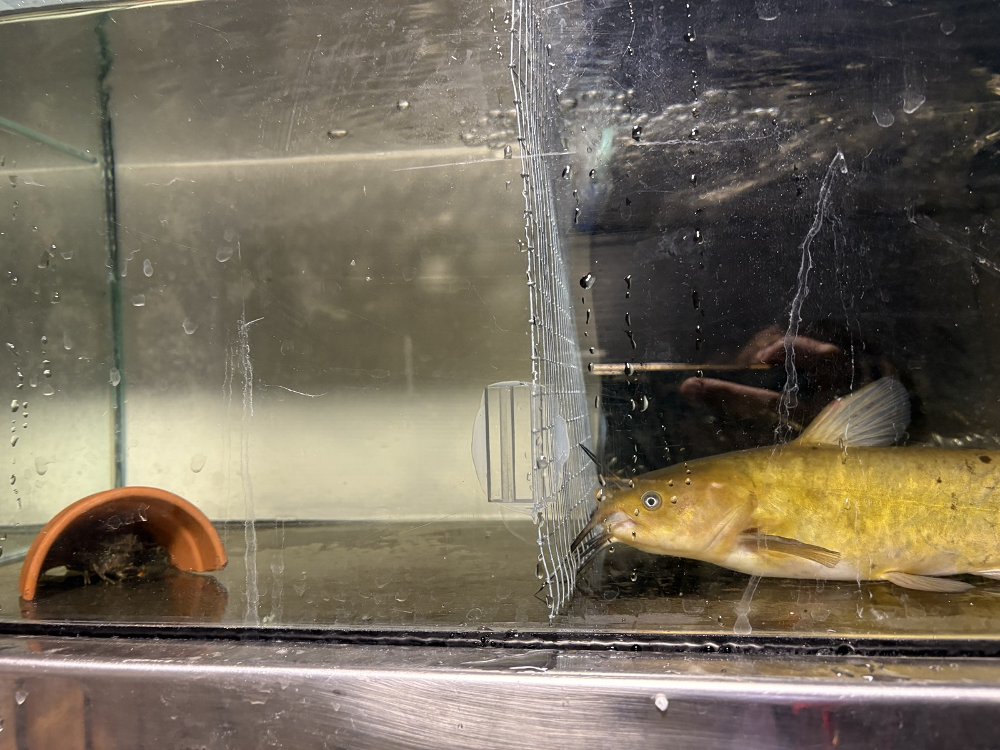

# Native vs. Novel Threats

{fig-align="center" width="100%"}

::: {.callout-note appearance="minimal"}
*How do native and non-native predators differentially influence antipredator behaviour and refuge use in kōura?*
:::

