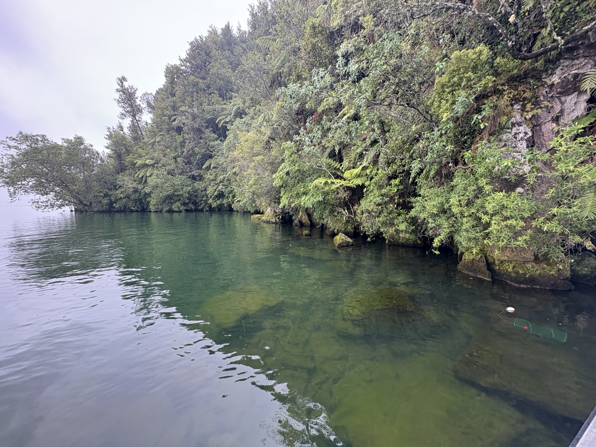

::: {.content-visible when-format="pdf"}
\thispagestyle{empty}
\AddToShipoutPictureBG*{\AtPageUpperLeft{\includegraphics[width=\paperwidth,height=\paperheight]{../images/ch3_cover.jpg}}}
\null
\newpage
\pagecolor{thesissand}
:::

# Where do Kōura Live

::: {.content-visible when-format="pdf"}
\vspace{1cm}
\begin{center}
\textit{Which natural shoreline features do kōura prefer?}
\end{center}
:::

::: {.content-visible unless-format="pdf"}
{fig-align="center" width="100%"}

*Which natural shoreline features do kōura prefer?*
:::

::: {.content-visible when-format="pdf"}
\afterpage{\pagecolor{thesiscream}}
:::

