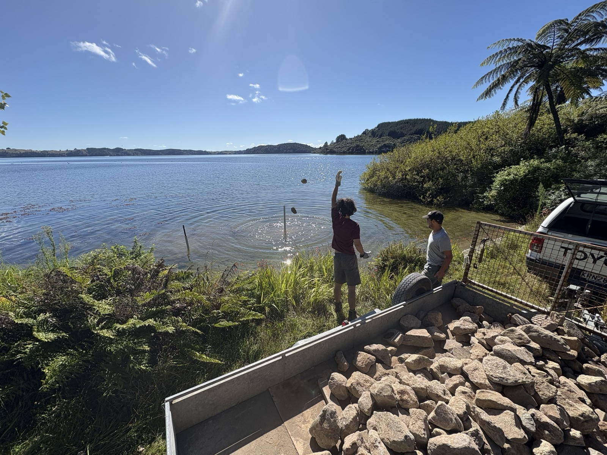

::: {.content-visible when-format="pdf"}
\thispagestyle{empty}
\AddToShipoutPictureBG*{\AtPageUpperLeft{\includegraphics[width=\paperwidth,height=\paperheight]{images/ch5_cover.jpg}}}
\null
\newpage
\pagecolor{thesissand}
:::

# Stone piles Rotoiti {.unnumbered}

::: {.content-visible when-format="pdf"}
\vspace{1cm}
\begin{center}
\textit{Can habitat enhancement structures provide effective habitat for kōura in Lake Rotoiti?}
\end{center}
:::

::: {.content-visible when-format="html"}
{fig-align="center" width="100%"}

*Can habitat enhancement structures provide effective habitat for kōura in Lake Rotoiti?*
:::

::: {.content-visible when-format="docx"}
{fig-align="center" width=15cm}

*Can habitat enhancement structures provide effective habitat for kōura in Lake Rotoiti?*
:::

::: {.content-visible when-format="pdf"}
\afterpage{\pagecolor{thesiscream}}
:::

