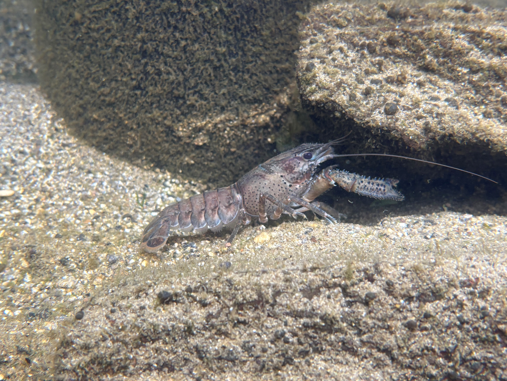

#  PhD Thesis {.unnumbered .unlisted}

::: {.content-visible when-format="html"}
[⬇ Download PDF](Restoring-native-freshwater-crayfish-habitat-in-invaded-lake-ecosystems.pdf){.btn .btn-outline-danger .btn-sm}
[⬇ Download Word](Restoring-native-freshwater-crayfish-habitat-in-invaded-lake-ecosystems.docx){.btn .btn-outline-primary .btn-sm}
:::

::: {.content-visible when-format="docx"}
{fig-align="center" width=15cm}
:::
