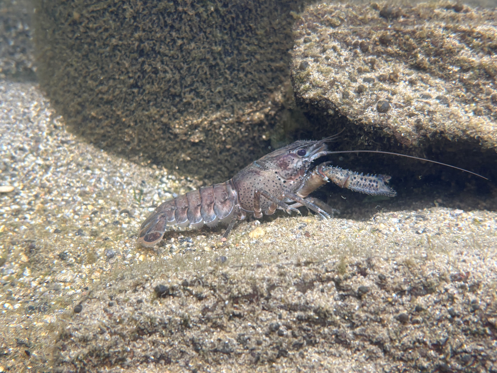

::: {.content-visible when-format="pdf"}
\frontmatter
\thispagestyle{empty}
\begin{tikzpicture}[remember picture, overlay]
  \fill[black] (current page.north west) rectangle ([yshift=-6cm]current page.north east);
  \fill[black] ([yshift=8cm]current page.south west) rectangle (current page.south east);
  \begin{scope}
    \clip ([yshift=-6cm]current page.north west)
          rectangle ([yshift=8cm]current page.south east);
    \node[inner sep=0pt, anchor=north]
      at ([yshift=-6cm]current page.north)
      {\includegraphics[width=\paperwidth]{images/thesis_cover.jpg}};
  \end{scope}
  \node[color=white, text width=0.92\paperwidth, align=center,
        font=\fontsize{28}{36}\selectfont\bfseries\sffamily]
    at ([yshift=-3cm]current page.north)
    {\hyphenpenalty=10000\exhyphenpenalty=10000 Enhancing native freshwater crayfish habitat in invaded lake ecosystems};
  \node[color=white, align=center,
        font=\fontsize{16}{22}\selectfont\sffamily]
    at ([yshift=4cm]current page.south)
    {Olivier V.\ Raven \\ 2026};
\end{tikzpicture}
\setcounter{chapter}{0}
\null
\clearpage
\thispagestyle{empty}
:::

::: {.content-visible when-format="docx"}
{fig-align="center" width=15cm}
:::

::: {.content-visible when-format="html"}
```{r}
#| label: thesis-landing-hero
#| echo: false
#| output: asis
#| eval: !expr knitr::is_html_output()
.img <- "images/thesis_cover.jpg"
if (file.exists(.img)) {
  cat(sprintf(
    '<div class="thesis-hero">
  
  <div class="thesis-hero-overlay"></div>
  <div class="thesis-hero-body">
    <span class="thesis-hero-eyebrow">PhD Thesis &middot; University of Waikato &middot; 2026</span>
    <h1 class="thesis-hero-title">Enhancing native freshwater crayfish habitat in invaded lake ecosystems</h1>
    <div class="thesis-hero-rule"></div>
    <span class="thesis-hero-author">Olivier V. Raven</span>
    <span class="thesis-hero-year">2026</span>
  </div>
</div>',
    knitr::image_uri(.img)
  ))
}
```
:::
